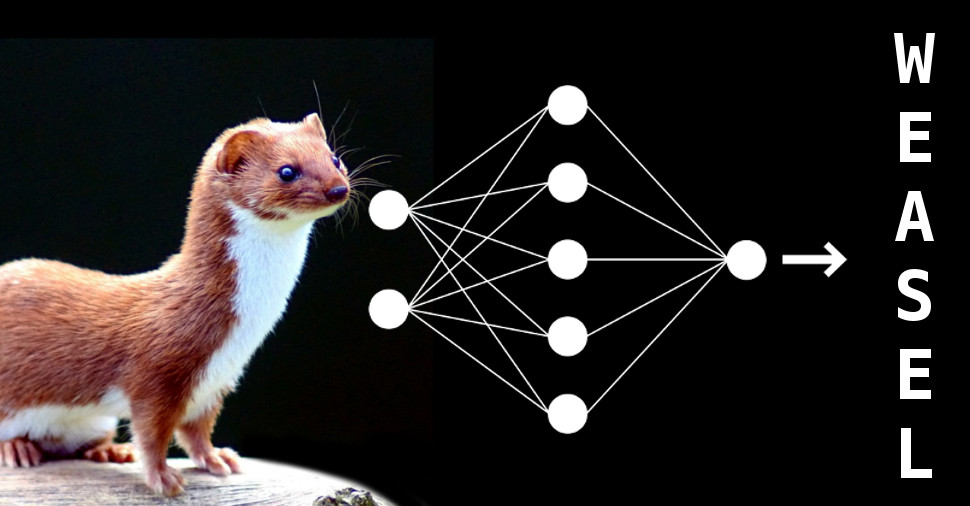

# VGG in Tensorflow

Model and pre-trained parameters for VGG16 in TensorFlow.

[All the sources come from here](https://www.cs.toronto.edu/~frossard/post/vgg16/)

## Files

  * Model weights - [vgg16_weights.npz](https://www.cs.toronto.edu/~frossard/vgg16/vgg16_weights.npz)
  * TensorFlow model - [vgg16.py](vgg16.py)
  * Class names - [imagenet_classes.py](imagenet_classes.py)
  * Example input - [laska.png](misc/laska.png)

To test run it, download all files to the same folder and run
```
  python vgg16.py
```

## Introduction

VGG is a convolutional neural network model proposed by K. Simonyan and A. Zisserman from the University of Oxford in the paper “Very Deep Convolutional Networks for Large-Scale Image Recognition”  . The model achieves 92.7% top-5 test accuracy in ImageNet, which is a dataset of over 14 million images belonging to 1000 classes.

In this short post we provide an implementation of VGG16 and the weights from the original Caffe model  converted to TensorFlow.



## Architecture

The macroarchitecture of VGG16 can be seen in Fig. 2. We code it in TensorFlow in file vgg16.py. Notice that we include a preprocessing layer that takes the RGB image with pixels values in the range of 0-255 and subtracts the mean image values (calculated over the entire ImageNet training set).


## Weights

We convert the Caffe weights publicly available in the author’s GitHub profile using a specialized tool. Some post-processing is done to ensure the model is in agreement with the TensorFlow standards. Finally, we arrive at the weights available in vgg16_weights.npz.


## Class Names

In order to associate the outputs of the model to class names we have the mapping available in imagenet_classes.py.

## Future Content

We encourage you to get familiar with this model since it is widely used and will be the baseline for future content on knowledge transfer, guided backpropagation and other interesting topics on convolutional neural networks.
